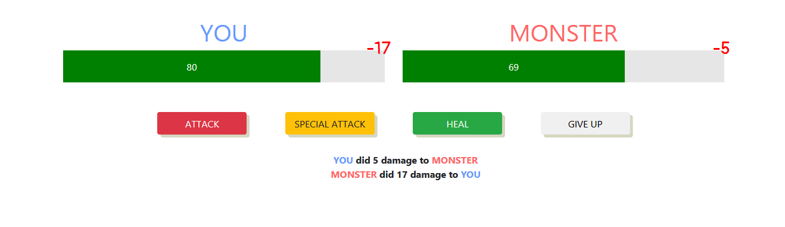
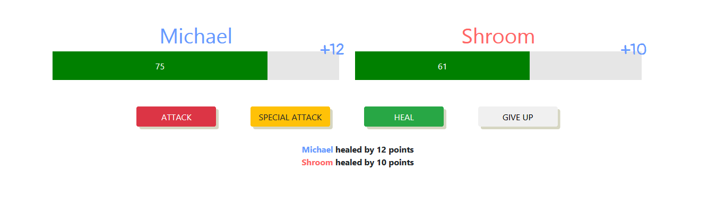
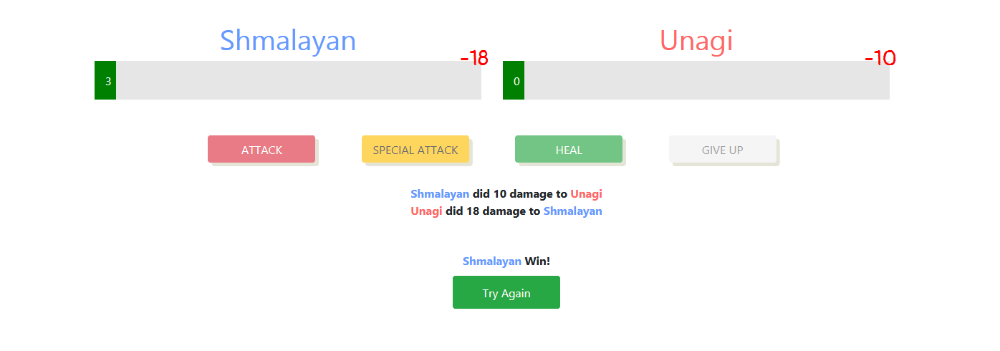

# You-VS-Monster
My first *mini* game ever created with only Vue.js! I'm using CDN version of Vue due to the simplicity of this project, i was just messing around with directives and properties of Vue, so it may not be perfect but it's awesome for me!

## Attacking :

## Healing :

## Fight Result :

## Built With

* [Vue.js](https://vuejs.org/) - JavaScript Framework
* [Bootstrap CSS](http://getbootstrap.com/) - CSS Framework

## Author

* **Muhammad Daivasmara Denaw** - [Daivasmara](https://github.com/Daivasmara)
