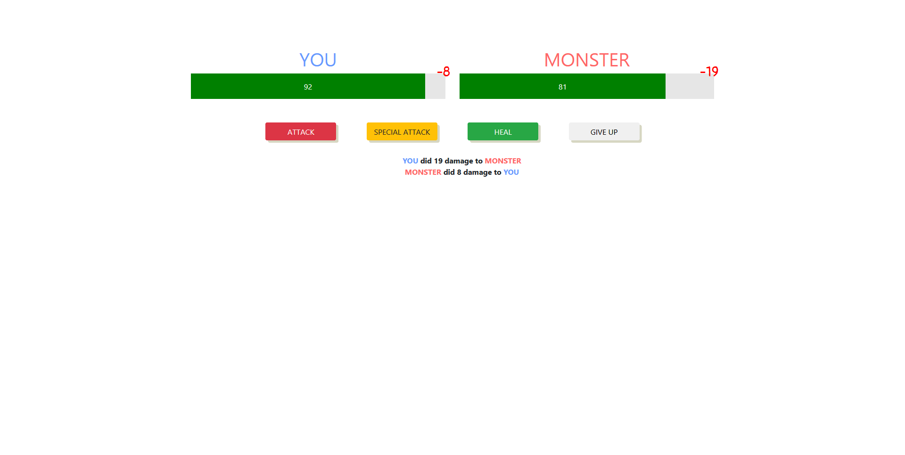

# You-VS-Monster
My first *mini* game ever created with Vue.js! I'm using CDN version of Vue due to the simplicity of this project, i was just messing around with directives and properties of vue, so it may not be perfect but it's awesome for me!

## Attacking :

## Healing :

